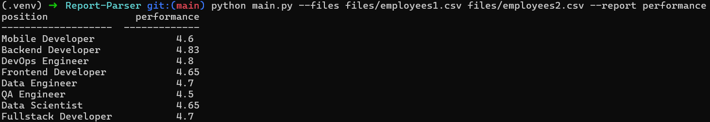
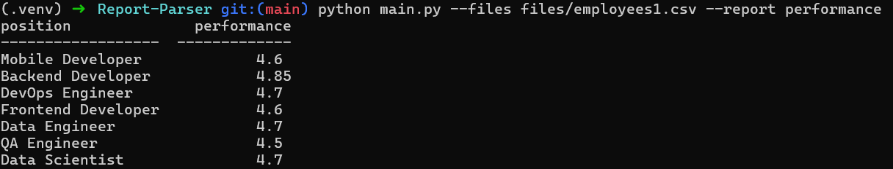

Клонируйте репозиторий
```
git clone git@github.com:kristinachernyaeva/Report-Parser.git
```
Создайте виртуальное окружение и установите необходимые зависимости
```
python3 -m venv .venv
source .venv/bin/activate # для Linux/Mac
.venv\Scripts\activate.bat # для Windows
pip install -r requirements.txt
```

Примеры запуска скрипта:

- с несколькими файлами:


- с одним файлом:


Для добавления новых видов отчетов необходимо расширить модуль `report_app/reports.py`, определив новый класс, унаследованный от абстрактного класса Report.

Абстрактный класс `Report` задает единый интерфейс для всех отчетов и содержит два обязательных элемента:

- Метод `get_report()`
Должен возвращать отчет в виде словаря вида
`{<поле>: <значение>}`.

- Свойство `headers`
Должно возвращать список заголовков, соответствующих ключам отчета.
Эти заголовки используются для форматирования табличного вывода.

После реализации отчета его необходимо зарегистрировать в словаре `report_methods` в модуле `main`:

```
report_methods = {
    "performance": PerformanceReport,
    "your_custom_report": YourCustomReport,
}
```
